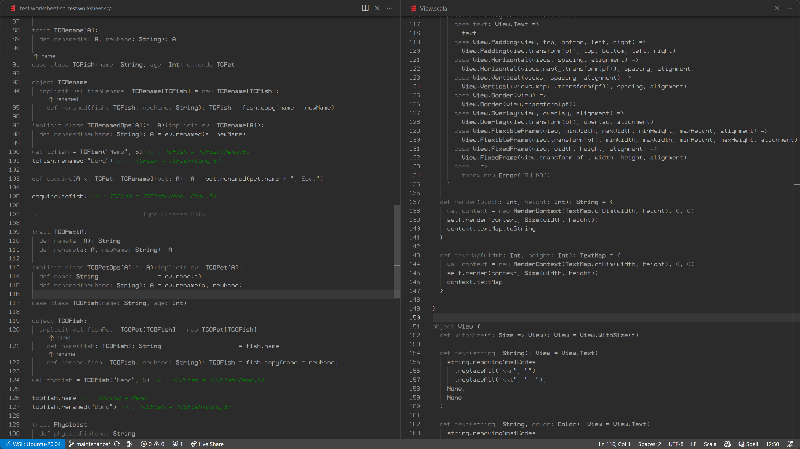

# Dark Doug

A dark variant grayscale theme for Visual Studio Code.

## Kudos

Inspired by a talk /I can't find/ by [Douglas Crockford](https://github.com/douglascrockford) and built upon the [Base16 Grayscale theme](https://github.com/brett-lempereur/theme-base16grayscale) by [Brett Lempereur](https://github.com/brett-lempereur).
